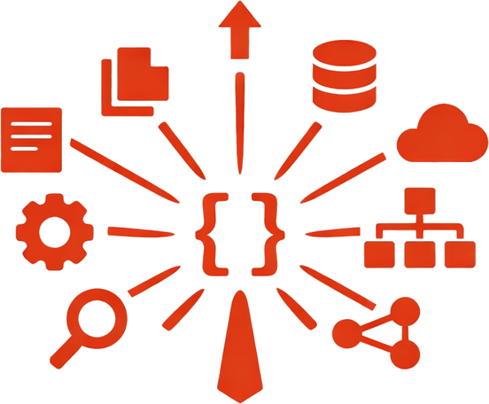

<a id="top"></a>

<p align="center">
  
  <h1 align="center">entity-derive</h1>
  <p align="center">
    <strong>One macro to rule them all</strong>
  </p>
  <p align="center">
    Generate DTOs, repositories, mappers, and SQL from a single entity definition
  </p>
</p>

<p align="center">
  <a href="https://crates.io/crates/entity-derive">
    
  </a>
  <a href="https://docs.rs/entity-derive">
    
  </a>
  <a href="https://github.com/RAprogramm/entity-derive/actions">
    
  </a>
</p>

<p align="center">
  <a href="https://codecov.io/gh/RAprogramm/entity-derive">
    
  </a>
  <a href="https://github.com/RAprogramm/entity-derive/blob/main/LICENSES/MIT.txt">
    
  </a>
  <a href="https://api.reuse.software/info/github.com/RAprogramm/entity-derive">
    
  </a>
  <a href="https://github.com/RAprogramm/entity-derive/wiki">
    
  </a>
</p>

---

## The Problem

Building a typical CRUD application requires writing the same boilerplate over and over: entity struct, create DTO, update DTO, response DTO, row struct, repository trait, SQL implementation, and 6+ From implementations.

**That's 200+ lines of boilerplate for a single entity.**

## The Solution

```rust,ignore
#[derive(Entity)]
#[entity(table = "users")]
pub struct User {
    #[id]
    pub id: Uuid,

    #[field(create, update, response)]
    pub name: String,

    #[field(create, update, response)]
    pub email: String,

    #[field(skip)]
    pub password_hash: String,

    #[field(response)]
    #[auto]
    pub created_at: DateTime<Utc>,
}
```

**Done.** The macro generates everything else.

---

## Installation

```toml
[dependencies]
entity-derive = { version = "0.4", features = ["postgres", "api"] }
```

---

## Features

| Feature | Description |
|---------|-------------|
| **Zero Runtime Cost** | All code generation at compile time |
| **Type Safe** | Change a field once, everything updates |
| **Auto HTTP Handlers** | `api(handlers)` generates CRUD endpoints + router |
| **OpenAPI Docs** | Auto-generated Swagger/OpenAPI documentation |
| **Query Filtering** | Type-safe `#[filter]`, `#[filter(like)]`, `#[filter(range)]` |
| **Relations** | `#[belongs_to]` and `#[has_many]` |
| **Aggregate Roots** | `#[entity(aggregate_root)]` with `New{T}` DTOs and transactional `save` |
| **Transactions** | Multi-entity atomic operations |
| **Lifecycle Events** | `Created`, `Updated`, `Deleted` events |
| **Real-Time Streams** | Postgres LISTEN/NOTIFY integration |
| **Lifecycle Hooks** | `before_create`, `after_update`, etc. |
| **CQRS Commands** | Business-oriented command pattern |
| **Soft Delete** | `deleted_at` timestamp support |

---

## Documentation

| Topic | Languages |
|-------|:---------:|
| **Getting Started** ||
| Attributes | [🇬🇧](https://github.com/RAprogramm/entity-derive/wiki/Attributes-en) [🇷🇺](https://github.com/RAprogramm/entity-derive/wiki/Attributes-ru) [🇰🇷](https://github.com/RAprogramm/entity-derive/wiki/Attributes-ko) [🇪🇸](https://github.com/RAprogramm/entity-derive/wiki/Attributes-es) [🇨🇳](https://github.com/RAprogramm/entity-derive/wiki/Attributes-zh) |
| Examples | [🇬🇧](https://github.com/RAprogramm/entity-derive/wiki/Examples-en) [🇷🇺](https://github.com/RAprogramm/entity-derive/wiki/Examples-ru) [🇰🇷](https://github.com/RAprogramm/entity-derive/wiki/Examples-ko) [🇪🇸](https://github.com/RAprogramm/entity-derive/wiki/Examples-es) [🇨🇳](https://github.com/RAprogramm/entity-derive/wiki/Examples-zh) |
| **Features** ||
| Filtering | [🇬🇧](https://github.com/RAprogramm/entity-derive/wiki/Filtering-en) [🇷🇺](https://github.com/RAprogramm/entity-derive/wiki/Filtering-ru) [🇰🇷](https://github.com/RAprogramm/entity-derive/wiki/Filtering-ko) [🇪🇸](https://github.com/RAprogramm/entity-derive/wiki/Filtering-es) [🇨🇳](https://github.com/RAprogramm/entity-derive/wiki/Filtering-zh) |
| Relations | [🇬🇧](https://github.com/RAprogramm/entity-derive/wiki/Relations-en) [🇷🇺](https://github.com/RAprogramm/entity-derive/wiki/Relations-ru) [🇰🇷](https://github.com/RAprogramm/entity-derive/wiki/Relations-ko) [🇪🇸](https://github.com/RAprogramm/entity-derive/wiki/Relations-es) [🇨🇳](https://github.com/RAprogramm/entity-derive/wiki/Relations-zh) |
| Events | [🇬🇧](https://github.com/RAprogramm/entity-derive/wiki/Events-en) [🇷🇺](https://github.com/RAprogramm/entity-derive/wiki/Events-ru) [🇰🇷](https://github.com/RAprogramm/entity-derive/wiki/Events-ko) [🇪🇸](https://github.com/RAprogramm/entity-derive/wiki/Events-es) [🇨🇳](https://github.com/RAprogramm/entity-derive/wiki/Events-zh) |
| Streams | [🇬🇧](https://github.com/RAprogramm/entity-derive/wiki/Streams-en) [🇷🇺](https://github.com/RAprogramm/entity-derive/wiki/Streams-ru) [🇰🇷](https://github.com/RAprogramm/entity-derive/wiki/Streams-ko) [🇪🇸](https://github.com/RAprogramm/entity-derive/wiki/Streams-es) [🇨🇳](https://github.com/RAprogramm/entity-derive/wiki/Streams-zh) |
| Hooks | [🇬🇧](https://github.com/RAprogramm/entity-derive/wiki/Hooks-en) [🇷🇺](https://github.com/RAprogramm/entity-derive/wiki/Hooks-ru) [🇰🇷](https://github.com/RAprogramm/entity-derive/wiki/Hooks-ko) [🇪🇸](https://github.com/RAprogramm/entity-derive/wiki/Hooks-es) [🇨🇳](https://github.com/RAprogramm/entity-derive/wiki/Hooks-zh) |
| Commands | [🇬🇧](https://github.com/RAprogramm/entity-derive/wiki/Commands-en) [🇷🇺](https://github.com/RAprogramm/entity-derive/wiki/Commands-ru) [🇰🇷](https://github.com/RAprogramm/entity-derive/wiki/Commands-ko) [🇪🇸](https://github.com/RAprogramm/entity-derive/wiki/Commands-es) [🇨🇳](https://github.com/RAprogramm/entity-derive/wiki/Commands-zh) |
| **Advanced** ||
| Custom SQL | [🇬🇧](https://github.com/RAprogramm/entity-derive/wiki/Custom-SQL-en) [🇷🇺](https://github.com/RAprogramm/entity-derive/wiki/Custom-SQL-ru) [🇰🇷](https://github.com/RAprogramm/entity-derive/wiki/Custom-SQL-ko) [🇪🇸](https://github.com/RAprogramm/entity-derive/wiki/Custom-SQL-es) [🇨🇳](https://github.com/RAprogramm/entity-derive/wiki/Custom-SQL-zh) |
| Web Frameworks | [🇬🇧](https://github.com/RAprogramm/entity-derive/wiki/Web-Frameworks-en) [🇷🇺](https://github.com/RAprogramm/entity-derive/wiki/Web-Frameworks-ru) [🇰🇷](https://github.com/RAprogramm/entity-derive/wiki/Web-Frameworks-ko) [🇪🇸](https://github.com/RAprogramm/entity-derive/wiki/Web-Frameworks-es) [🇨🇳](https://github.com/RAprogramm/entity-derive/wiki/Web-Frameworks-zh) |
| Best Practices | [🇬🇧](https://github.com/RAprogramm/entity-derive/wiki/Best-Practices-en) [🇷🇺](https://github.com/RAprogramm/entity-derive/wiki/Best-Practices-ru) [🇰🇷](https://github.com/RAprogramm/entity-derive/wiki/Best-Practices-ko) [🇪🇸](https://github.com/RAprogramm/entity-derive/wiki/Best-Practices-es) [🇨🇳](https://github.com/RAprogramm/entity-derive/wiki/Best-Practices-zh) |

---

## Quick Reference

### Entity Attributes

```rust,ignore
#[entity(
    table = "users",           // Required: table name
    schema = "public",         // Optional: schema (default: omitted)
    dialect = "postgres",      // Optional: database dialect
    aggregate_root,            // Optional: New{T} DTOs + transactional save
    soft_delete,               // Optional: use deleted_at instead of DELETE
    events,                    // Optional: generate lifecycle events
    streams,                   // Optional: real-time Postgres NOTIFY
    hooks,                     // Optional: before/after lifecycle hooks
    commands,                  // Optional: CQRS command pattern
    transactions,              // Optional: multi-entity transaction support
    api(                       // Optional: generate HTTP handlers + OpenAPI
        tag = "Users",
        handlers,              // All CRUD, or handlers(get, list, create)
        security = "bearer",   // cookie, bearer, api_key, or none
        title = "My API",
        api_version = "1.0.0",
    ),
)]
```

### Field Attributes

```rust,ignore
#[id]                          // Primary key (auto-generated UUID)
#[auto]                        // Auto-generated (timestamps)
#[field(create)]               // Include in CreateRequest
#[field(update)]               // Include in UpdateRequest
#[field(response)]             // Include in Response
#[field(skip)]                 // Exclude from all DTOs
#[filter]                      // Exact match filter
#[filter(like)]                // ILIKE pattern filter
#[filter(range)]               // Range filter (from/to)
#[belongs_to(Entity)]          // Foreign key relation
#[has_many(Entity)]            // One-to-many relation
#[projection(Name: fields)]    // Partial view
```

---

## Code Coverage

<p align="center">
  <a href="https://codecov.io/gh/RAprogramm/entity-derive">
    
  </a>
</p>

